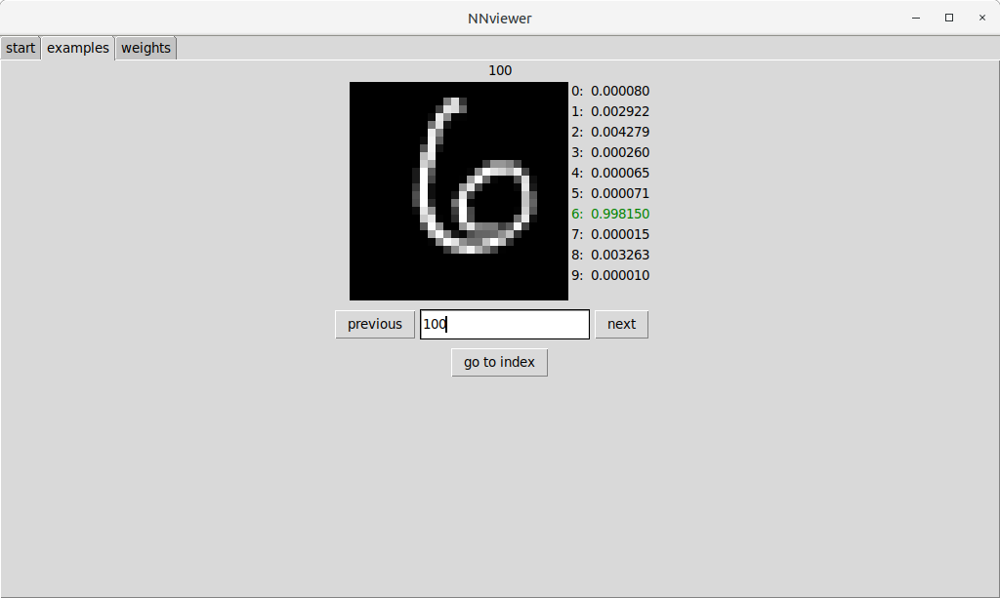
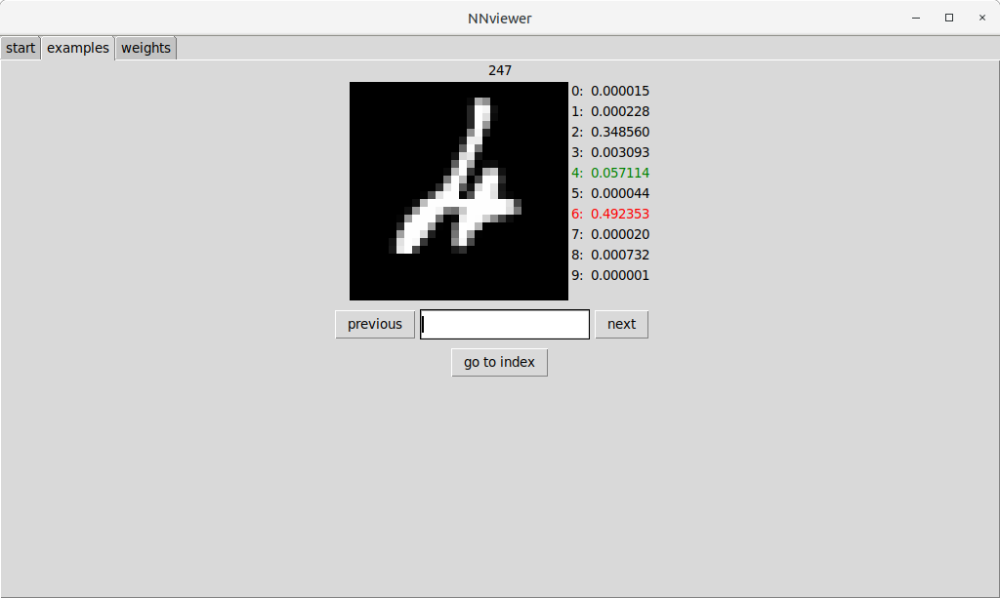
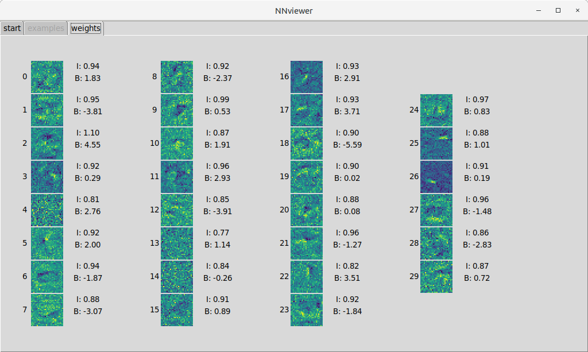
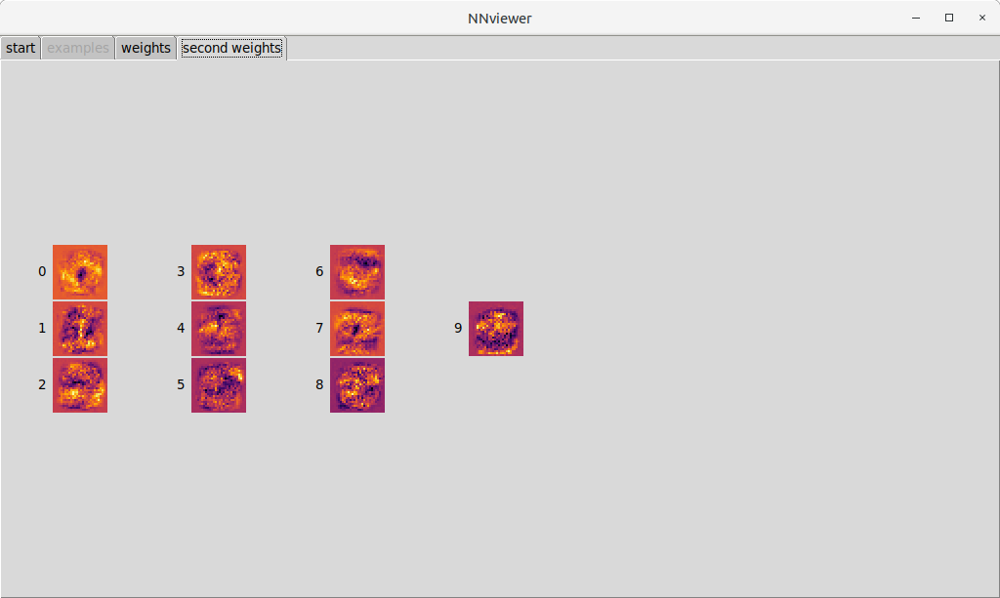
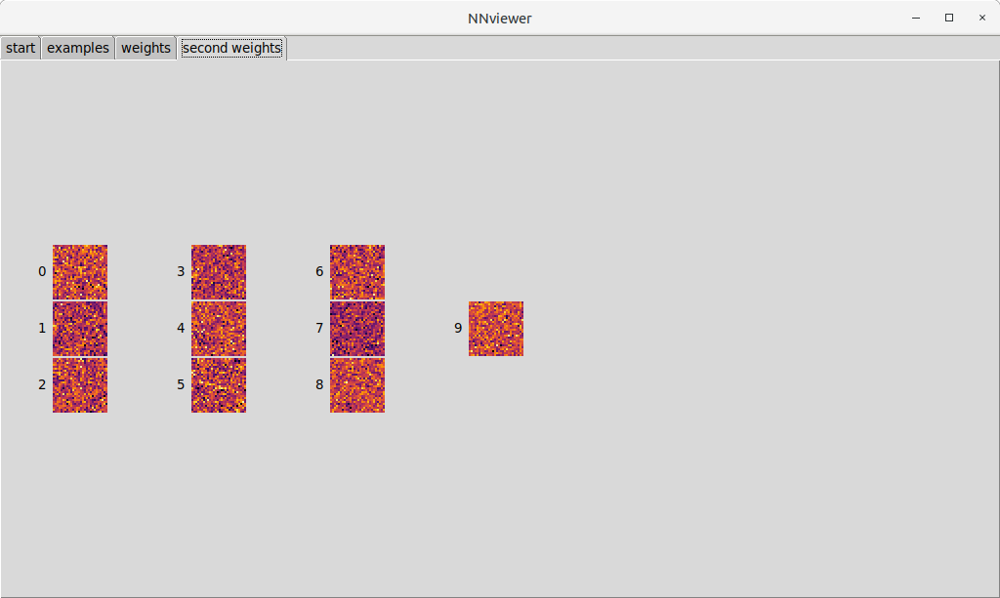

# NNviewer
### Neural network visualizer
Example: MNIST database of handwritten digits
-
#### Correct classification

#### incorrect classification

#### Neuron weights  - input layer

#### Neuron weights  - penultimate layer

#### Neuron weights  - penultimate layer - bad network

