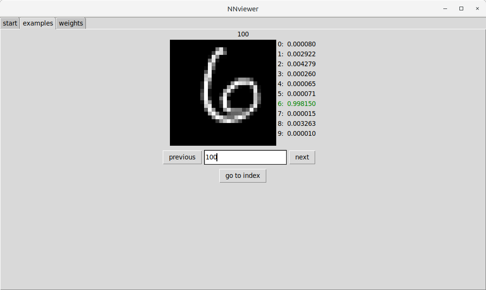
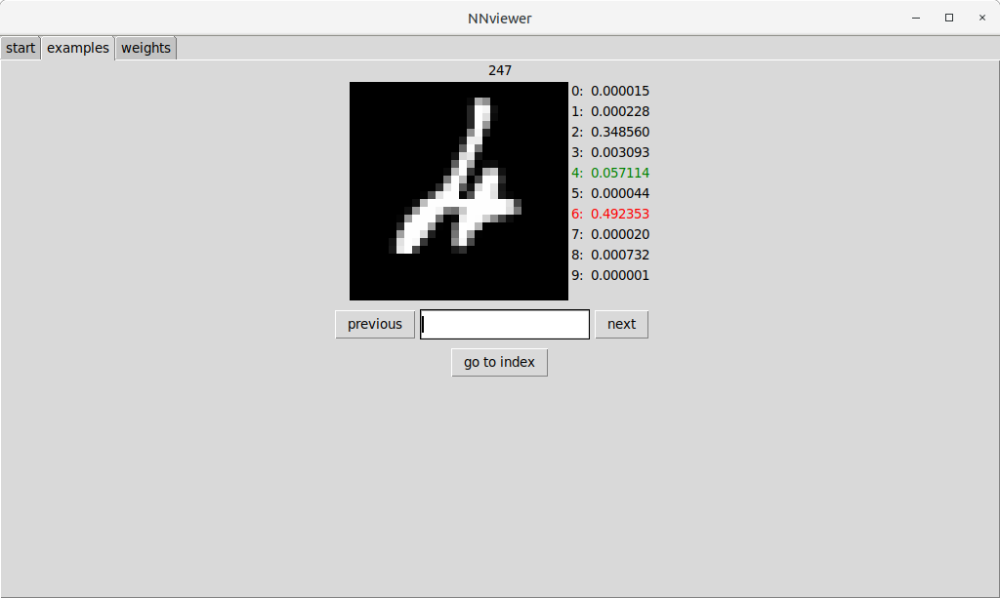
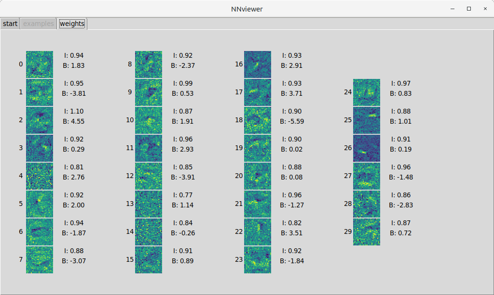
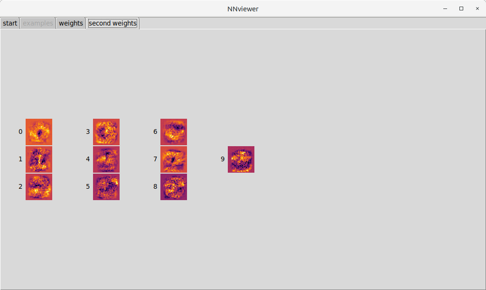
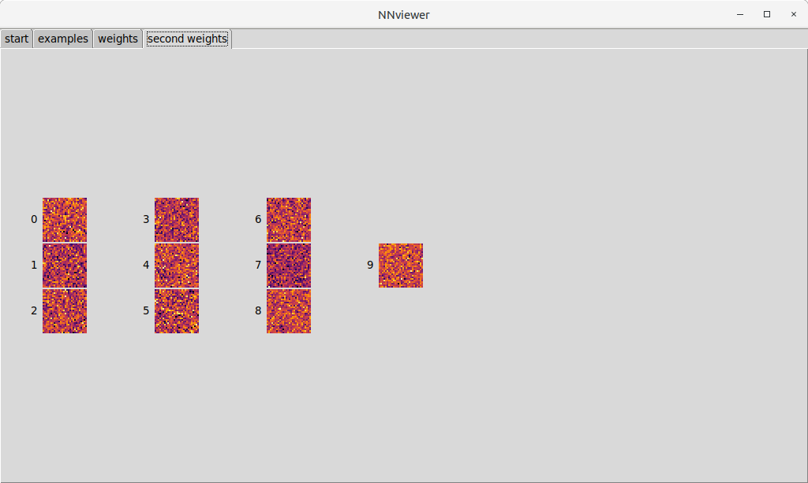

# NNviewer - Neural network visualizer

Developed to provide visual feedback about neural networks. Network formatted as in the book
["Neural networks and deep learning"](http://neuralnetworksanddeeplearning.com/) by [Michael Nielsen](https://github.com/mnielsen).

#### Example: MNIST database of handwritten digits
---
#### Correct classification

#### Incorrect classification

#### Neuron weights  - input layer

#### Neuron weights  - penultimate layer
Note how the visualized weights resemble the general characteristics of each digit

#### Neuron weights  - penultimate layer - bad network

